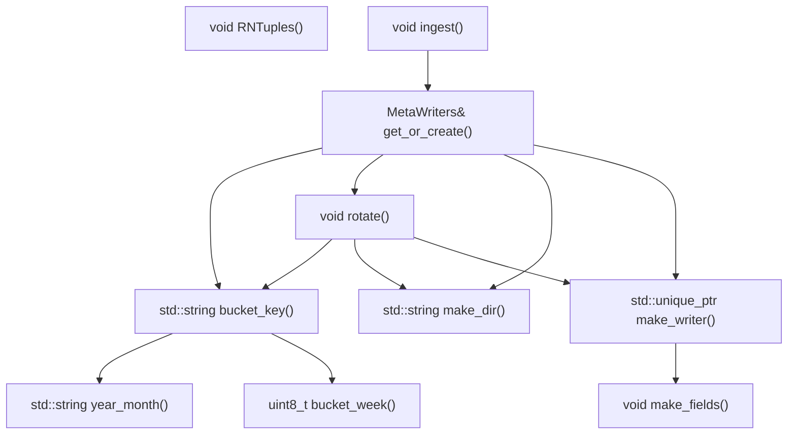
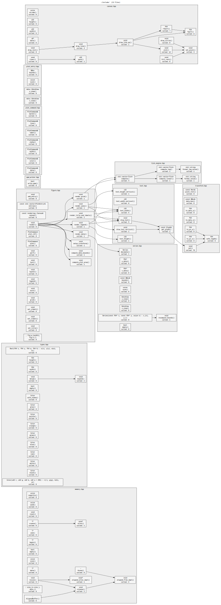

# calltree.sh 🌳

ASCII call tree generator for **C, C++, Python, Rust, Go, Java, JavaScript, TypeScript, Ruby, Lua, PHP, Perl, C#, Kotlin, Scala, Swift** and ~25 other languages — single file or entire project.
Parses function definitions via [universal-ctags](https://github.com/universal-ctags/ctags) and call edges via a small Perl backend, then renders them as a tree in the terminal.
Supports cross-file call resolution, recursive directory scanning, whitelist/blacklist filtering, and exports to Mermaid, Graphviz DOT, and plain text.

```
  src/sink/rntuple.hpp  (depth=4)

RNTuples()  -> void

ingest()  -> void
└── get_or_create()  -> MetaWriters&
    ├── bucket_key()  -> std::string
    │   ├── year_month()  -> std::string
    │   └── bucket_week()  -> uint8_t
    ├── rotate()  -> void
    │   ├── bucket_key()  -> std::string  [seen]
    │   ├── make_dir()  -> std::string
    │   └── make_writer()  -> std::unique_ptr<ROOT::RNTupleWriter>
    │       └── make_fields()  -> void
    ├── make_dir()  -> std::string
    └── make_writer()  -> std::unique_ptr<ROOT::RNTupleWriter>  [seen]
```

---

## Dependencies

| Dep | Notes |
|-----|-------|
| `bash` | >= 4.0 |
| `perl` | Standard on Linux and macOS; only `JSON::PP` is needed, which has been in Perl core since 5.14 |
| `universal-ctags` | With `+json` feature. Not exuberant-ctags. |
| `graphviz` | Optional — only needed to render `.dot` output (`dot -Tsvg`) |

Install universal-ctags:

```bash
# Debian / Ubuntu
sudo apt install universal-ctags

# Fedora
sudo dnf install ctags

# Arch
sudo pacman -S ctags

# macOS
brew install universal-ctags

# FreeBSD
pkg install universal-ctags
```

Verify:

```bash
ctags --version | head -1          # must say "Universal Ctags"
ctags --list-features | grep json  # must list "json"
```

---

## Installation

```bash
git clone https://github.com/MoonFlowww/CallTree
cd CallTree
chmod +x calltree.sh
```

Or drop `calltree.sh` anywhere on your `$PATH`:

```bash
cp calltree.sh ~/.local/bin/calltree
```

---

## Usage

```
# Single file
./calltree.sh -F <file> [OPTIONS]

# Multiple explicit files
./calltree.sh -F file1.cpp -F file2.cpp -F file3.hpp [OPTIONS]

# Recursive directory scan
./calltree.sh -D <src/> [OPTIONS]

# Directory scan with filtering
./calltree.sh -D <src/> -I "*.cpp" -E "test_*" [OPTIONS]
```

### Options

| Flag | Argument | Default | Description |
|------|----------|---------|-------------|
| `-F` | `FILE` | — | Input **F**ile. Repeatable — multiple `-F` flags accumulate |
| `-D` | `DIR` | — | Recursively scan **D**irectory. Repeatable |
| `-I` | `PATTERN` | — | **I**nclude glob, basename match. Repeatable. Applied before `-E`. When absent, all files pass |
| `-E` | `PATTERN` | — | **E**xclude glob, basename match. Repeatable. Takes precedence over `-I` matches |
| `-f` | `FUNC` | auto | **f**ind function: start tree from it. Accepts a bare function name (auto-picks the first file that defines it) or a fully-qualified key `filepath::::funcname` to pin a specific file |
| `--depth` | `N` | `4` | Recursion depth in the tree |
| `-out-T` | `[FILE]` | `<base>.txt` | Write plain-**T**ext tree (no ANSI codes) |
| `-out-M` | `[FILE]` | `<base>.mmd` | Write **M**ermaid graph. Multi-file mode wraps each file's functions in a named subgraph |
| `-out-D` | `[FILE]` | `<base>.dot` | Write Graphviz **D**OT. Multi-file mode wraps each file's functions in a cluster |
| `-c` | — | off | **C**olorize function names in terminal using 256-color ANSI |
| `-s` | — | off | **S**ee — always expand repeated subtrees (disable `[seen]` compression) |
| `-p` | — | off | Show **p**erformance footer: mapping/print/file timings plus line counters |
| `-v` | — | — | Print **v**ersion and exit |
| `-w` | — | — | Print absolute path to this script (**w**here) and exit |
| `-h`, `--help` | — | — | Show help and exit |

File arguments for `-out-*` flags are optional. When omitted, the output path is derived automatically:

```bash
# Single file
./calltree.sh -F src/foo.cpp -out-M              # → src/foo.mmd
./calltree.sh -F src/foo.cpp -out-M graph.mmd    # → graph.mmd

# -D
./calltree.sh -D src/ -out-M                     # → src/calltree.mmd
./calltree.sh -D src/ -out-D                     # → src/calltree.dot

# Multiple -F files (no -D)
./calltree.sh -F a.cpp -F b.cpp -out-D           # → ./calltree.dot
```

### Supported languages

Anything universal-ctags can parse is a candidate; the backend has an explicit kind allow-list for the languages below and a permissive fallback for everything else.

| Language | Extensions | Return types |
|---|---|---|
| C / C++ | `.c .h .cpp .hpp .cc .cxx .hxx` | yes |
| C# | `.cs` | yes |
| Python | `.py` | `-` (no annotations) |
| Go | `.go` | yes |
| Rust | `.rs` | yes (parsed from signature `-> T`) |
| Java | `.java` | yes |
| JavaScript / TypeScript | `.js .jsx .ts .tsx` | partial (TS yes) |
| Ruby | `.rb` | `-` |
| Lua | `.lua` | `-` |
| PHP | `.php` | yes |
| Perl | `.pl .pm` | `-` |
| Kotlin | `.kt` | yes |
| Scala | `.scala` | yes |
| Swift | `.swift` | yes |
| Haskell, OCaml, F# | `.hs .ml .fs` | best effort |

For languages without type annotations (Python, Ruby, Lua, Perl), the return type column shows `-`.

---

## Single-file examples

### Basic tree

```bash
./calltree.sh -F src/sink/rntuple.hpp
```

### Limit depth

```bash
./calltree.sh -F src/sink/rntuple.hpp --depth 2
```

```
ingest()  -> void
└── get_or_create()  -> MetaWriters&
    ├── bucket_key()  -> std::string
    ├── rotate()  -> void
    ├── make_dir()  -> std::string
    └── make_writer()  -> std::unique_ptr<ROOT::RNTupleWriter>
```

### Start from a specific function

```bash
./calltree.sh -F src/sink/rntuple.hpp -f rotate
```

```
rotate()  -> void
├── bucket_key()  -> std::string
│   ├── year_month()  -> std::string
│   └── bucket_week()  -> uint8_t
├── make_dir()  -> std::string
└── make_writer()  -> std::unique_ptr<ROOT::RNTupleWriter>
    └── make_fields()  -> void
```

### Terminal colors

```bash
./calltree.sh -F src/sink/rntuple.hpp -c
```

Each function name is assigned a unique 256-color ANSI color.
Colors are derived from the sorted function list so they stay stable across runs.
The usable palette is clamped to indices `40–210` — near-black and near-white tones are excluded.

```
color index = 40 + round(170 * i / (N - 1))
```

Colors also apply in the summary table's `calls` column.

### Performance footer

```bash
./calltree.sh -F src/sink/rntuple.hpp -p
```

Shows backend timing, render timing, and line counters for source and terminal output:

```
  mapping        207 ms
  print           43 ms
  ──────────────────────
  total          250 ms

  read           127 lines (src)
  write           70 lines (cli)
```

When combined with any `-out-*` flag, a `file` row is added to both the timings and the line counters:

```
  mapping        207 ms
  print           43 ms
  file           112 ms
  ──────────────────────
  total          362 ms

  read           127 lines (src)
  write           70 lines (cli)
                 206 lines (file)
```

| Row | Meaning |
|---|---|
| `mapping` | ctags parse + perl call-edge analysis + bash array load |
| `print` | Tree traversal and summary table render for the terminal |
| `file` | All `-out-*` file writes combined (only shown when at least one is requested) |
| `total` | Wall time of the entire run |
| `read` | Raw source lines consumed |
| `write / cli` | Lines written to the terminal |
| `write / file` | Lines written across all `-out-*` files (only when requested) |

### Export to Mermaid

```bash
./calltree.sh -F src/sink/rntuple.hpp -out-M
```

Writes `src/sink/rntuple.mmd`, fenced in ` ```mermaid ``` ` blocks so it renders directly when pasted into a GitHub README, GitLab wiki, or Notion page.



### Export to Graphviz DOT

```bash
./calltree.sh -F src/sink/rntuple.hpp -out-D
```

Render the `.dot` file to SVG or PNG:

```bash
dot -Tsvg -o graph.svg src/sink/rntuple.dot
dot -Tpng -o graph.png src/sink/rntuple.dot
```

Node labels include the return type and call frequency.


### Export to plain text

```bash
./calltree.sh -F src/sink/rntuple.hpp -out-T
```

Identical layout to the terminal output, with no ANSI codes — safe to `grep`, `diff`, or commit.

```txt
  src/sink/rntuple.hpp  (depth=4)

rotate()  -> void
├── bucket_key()  -> std::string
│   ├── year_month()  -> std::string
│   └── bucket_week()  -> uint8_t
├── make_dir()  -> std::string
└── make_writer()  -> std::unique_ptr<ROOT::RNTupleWriter>
    └── make_fields()  -> void


  function                      called  calls                                     return type
  ────────────────────────────  ──────  ────────────────────────────────────────  ──────────────────────
  bucket_week                        1  ----                                      uint8_t
  year_month                         1  ----                                      std::string
  bucket_key                         2  year_month bucket_week                    std::string
  make_dir                           2  ----                                      std::string
  rotate                             1  bucket_key make_dir make_writer           void
  make_fields                        1  ----                                      void
  make_writer                        2  make_fields                               std::unique_ptr<ROOT::RNTupleWriter>
```

### All outputs at once

```bash
./calltree.sh -F src/sink/rntuple.hpp -c -s -p -out-T -out-M -out-D
```

---

## Multi-file examples

Multi-file mode is activated whenever more than one file is provided, either via multiple `-F` flags or via `-D`. All flags continue to work identically; the only visual changes are the `[basename]` annotations in the tree and an extra `file` column in the summary table.

### Two explicit files

```bash
./calltree.sh -F src/core.cpp -F src/net.cpp --depth 3
```

```
  2 files  (depth=3)

dispatch()  [core.cpp]  -> void
├── make_key()  [core.cpp]  -> std::string
│   └── format()  [net.cpp]  -> int
└── send()  [net.cpp]  -> void
    ├── encode()  [net.cpp]  -> std::string
    │   └── compress()  [net.cpp]  -> std::string
    └── flush()  [net.cpp]  -> void
        └── write_buf()  [net.cpp]  -> void


  function                      file                    called  calls                                     return type
  ────────────────────────────  ──────────────────────  ──────  ────────────────────────────────────────  ──────────────────────
  make_key                      core.cpp                     1  format                                    std::string
  dispatch                      core.cpp                     0  make_key send                             void
  send                          net.cpp                      1  encode flush                              void
  ...
```

Cross-file calls are shown inline in the tree. The `[basename]` tag after each function name shows which file it lives in — it only appears in multi-file mode.

### Recursive directory scan

```bash
./calltree.sh -D src/ --depth 4
```

Scans `src/` recursively for all supported source files (sorted, deduplicated), analyzes them as a single unit, and prints the unified call tree.

### Directory scan with filtering

```bash
# Only implementation files, not headers
./calltree.sh -D src/ -I "*.cpp"

# Exclude generated and test files
./calltree.sh -D src/ -E "*.pb.cc" -E "test_*" -E "*_mock.*"

# Combined — only implementation, no tests
./calltree.sh -D src/ -I "*.cpp" -E "test_*"

# Mixed-language project: only Rust and Go
./calltree.sh -D src/ -I "*.rs" -I "*.go"
```

`-I` and `-E` both match against the **basename** of each file using standard shell glob syntax. Processing order: `-I` is applied first (if any are specified); then `-E` is applied to the surviving set. Both flags are repeatable.

### Rooting across files

```bash
# Bare function name — auto-picks the first file that defines it
./calltree.sh -D src/ -f dispatch

# Fully-qualified key — pin to a specific file when the name is ambiguous
./calltree.sh -D src/ -f "src/core.cpp::::dispatch"
```

The `FILE::::FUNC` key syntax uses four colons as a separator, safe because `::::` cannot appear in typical source-code identifiers or paths.

### Multi-file Mermaid export

```bash
./calltree.sh -D src/ -out-M
# → src/calltree.mmd
```

Each file's functions are grouped in a named `subgraph`. Cross-file edges connect nodes across subgraphs automatically. Node IDs use `SAFE_BASENAME_funcname` to stay unique even when two files define a function with the same name.

```mermaid
flowchart TD
  subgraph figure_hpp["figure.hpp"]
    figure_hpp_Figure["void Figure()"]
    figure_hpp_set_title["void set_title()"]
    figure_hpp_set_xlabel["void set_xlabel()"]
    figure_hpp_set_ylabel["void set_ylabel()"]
    figure_hpp_grid["void grid()"]
    figure_hpp_axis["void axis()"]
    figure_hpp_legend["void legend()"]
    figure_hpp_layout["void layout()"]
    figure_hpp_text["void text()"]
    figure_hpp_perf["void perf()"]
    figure_hpp_plot["PlotCommand plot()"]
    figure_hpp_plot_ref["PlotCommand plot_ref()"]
    figure_hpp_render["void render()"]
    figure_hpp_canvas["const rendering::Canvas & canvas()"]
    figure_hpp_entries["const std::vector<PlotEntry> & entries()"]
    figure_hpp_add_entry["void add_entry()"]
    figure_hpp_compute_plot_area["void compute_plot_area()"]
    figure_hpp_compute_data_bounds["void compute_data_bounds()"]
    figure_hpp_setup_transform["void setup_transform()"]
    figure_hpp_render_grid["void render_grid()"]
    figure_hpp_render_axes["void render_axes()"]
    figure_hpp_render_data["void render_data()"]
    figure_hpp_render_legend["void render_legend()"]
    figure_hpp_render_title_and_labels["void render_title_and_labels()"]
  end
  subgraph text_hpp["text.hpp"]
    text_hpp_get_glyph["const Glyph & get_glyph()"]
    text_hpp___anon0566b84d0102["bool __anon0566b84d0102()"]
    text_hpp___anon0566b84d0202["void __anon0566b84d0202()"]
    text_hpp_draw_text["void draw_text()"]
    text_hpp_draw_text_vertical["void draw_text_vertical()"]
    text_hpp_text_width["i32 text_width()"]
    text_hpp_text_height["i32 text_height()"]
    text_hpp_text_width_vertical["i32 text_width_vertical()"]
    text_hpp_text_height_vertical["i32 text_height_vertical()"]
  end
  subgraph tick_engine_hpp["tick_engine.hpp"]
    tick_engine_hpp_compute["std::vector<Tick> compute()"]
    tick_engine_hpp_compute_linear["std::vector<Tick> compute_linear()"]
    tick_engine_hpp_compute_log["std::vector<Tick> compute_log()"]
    tick_engine_hpp_format_value["std::string format_value()"]
    tick_engine_hpp_format_log_value["std::string format_log_value()"]
  end

  figure_hpp_render --> figure_hpp_compute_plot_area
  figure_hpp_render --> figure_hpp_compute_data_bounds
  figure_hpp_render --> figure_hpp_setup_transform
  figure_hpp_render --> figure_hpp_render_grid
  figure_hpp_render --> figure_hpp_render_axes
  figure_hpp_render --> figure_hpp_render_data
  figure_hpp_render --> figure_hpp_render_legend
  figure_hpp_render --> figure_hpp_render_title_and_labels
  figure_hpp_render_grid --> tick_engine_hpp_compute
  figure_hpp_render_axes --> tick_engine_hpp_compute
  figure_hpp_render_axes --> text_hpp_text_width
  figure_hpp_render_axes --> text_hpp_draw_text
  figure_hpp_render_legend --> text_hpp_text_height
  figure_hpp_render_legend --> text_hpp_text_width
  figure_hpp_render_legend --> text_hpp_draw_text
  figure_hpp_render_title_and_labels --> text_hpp_text_width
  figure_hpp_render_title_and_labels --> text_hpp_draw_text
  figure_hpp_render_title_and_labels --> text_hpp_text_height_vertical
  figure_hpp_render_title_and_labels --> text_hpp_draw_text_vertical
  text_hpp_draw_text --> text_hpp_get_glyph
  text_hpp_draw_text_vertical --> text_hpp_get_glyph
  tick_engine_hpp_compute --> tick_engine_hpp_compute_log
  tick_engine_hpp_compute --> tick_engine_hpp_compute_linear
  tick_engine_hpp_compute_linear --> tick_engine_hpp_format_value
  tick_engine_hpp_compute_log --> tick_engine_hpp_format_log_value

```



### Multi-file DOT export

```bash
./calltree.sh -D src/ -out-D
dot -Tsvg -o graph.svg src/calltree.dot
```

Each file becomes a `subgraph cluster_N` with its own label and a light grey background. Cross-cluster edges are drawn between the full-path node IDs.



---

## Summary table

The table is always printed below the tree. In multi-file mode it gains a `file` column.

**Single-file:**
```
  function                      called  calls                                     return type
  ────────────────────────────  ──────  ────────────────────────────────────────  ──────────────────────
  bucket_week                        1  ----                                      uint8_t
  year_month                         1  ----                                      std::string
  bucket_key                         2  year_month bucket_week                    std::string
  make_dir                           2  ----                                      std::string
  rotate                             1  bucket_key make_dir make_writer           void
  make_fields                        1  ----                                      void
  make_writer                        2  make_fields                               std::unique_ptr<ROOT::RNTupleWriter>
```

**Multi-file:**
```
  function                      file                    called  calls                                     return type
  ────────────────────────────  ──────────────────────  ──────  ────────────────────────────────────────  ──────────────────────
  make_key                      core.cpp                     1  format                                    std::string
  dispatch                      core.cpp                     0  make_key send                             void
  send                          net.cpp                      1  encode flush                              void
  ...
```

| Column | Description |
|--------|-------------|
| `function` | Function name as defined in the file |
| `file` | Basename of the file where the function is defined *(multi-file mode only)* |
| `called` | Total number of times this function is invoked across all callers in the analyzed set |
| `calls` | Space-separated list of functions this function calls (display names only, stripped of file path) |
| `return type` | Extracted from ctags `typeref` or parsed from the signature; `-` for untyped languages |

---

## How it works

### Pipeline

```
  universal-ctags  ──(JSON tags)──▶  perl backend  ──(CALLS/TYPES/FREQ)──▶  bash renderer
```

1. **ctags** parses every input file and emits one JSON line per tag (function/method/sub) with fields: `name`, `path`, `language`, `line`, `end`, `kind`, `typeref`, `signature`.
2. **perl** consumes the stream, filters by a per-language kind allow-list, builds a global `funcname → [files]` registry, re-opens each source file, extracts the body range `line..end` for each function, and scans it for callees matching known names (excluding method calls via a `(?<![>.])` lookbehind).
3. **bash** loads the emitted `CALLS`/`TYPES`/`FREQ` tables into associative arrays and renders the tree, summary table, and optional `-out-*` exports.

### Single-file vs multi-file

In single-file mode, function keys are bare names. In multi-file mode, the internal key is `filepath::::funcname` throughout — in the tree, the table, and the export files. The four-colon separator is chosen because it cannot appear in most language identifiers. Display always strips the path back to a bare function name; the file is shown separately as an annotation or table column.

### What counts as a function

ctags classifies each tag with a language-specific `kind`. The backend has an explicit allow-list per language:

| Language | Accepted kinds |
|---|---|
| C, C++ | `function` |
| C# | `method` |
| Python | `function`, `member` (class methods) |
| Go | `func` |
| Rust | `function`, `method` |
| Java, Kotlin | `method` |
| JavaScript, TypeScript | `function`, `method`, `getter`, `setter`, `generator` |
| Ruby | `method`, `singletonMethod` |
| Lua, PHP | `function` |
| Perl | `subroutine` |
| Scala, Swift | `method`, `function` |

For any other language, the default fallback accepts `function`, `method`, `func`, `fn`, `subroutine`.

### Return type extraction

Three strategies, tried in order:

1. **ctags `typeref` field** — populated for C, C++, Go, Java, TypeScript, Kotlin, PHP, and others. Contains the raw type, prefixed with `typename:` which is stripped.
2. **Signature parsing** — Rust and some other languages embed the return type inside the signature as `(args) -> Type`. The backend extracts the `-> ...` tail when `typeref` is missing.
3. **Fallback** — `void` for C/C++ when nothing else matches; `-` for languages without static return types (Python, Ruby, Lua, Perl, untyped JS).

### Call edge detection

For each function, the backend reads lines `line..end` from the source file, strips comments and string literals (best-effort, not language-perfect), then scans for `\bname\s*\(` where `name` is in the global function registry. Identifiers preceded by `.` or `->` (method calls) are excluded via a lookbehind — this works uniformly for C/C++/Rust/Go/Java/Python/JS.

### Cross-file call resolution

The Perl pass runs once on all input files. Pass 1 builds a global `funcname → [files that define it]` registry. Pass 2 scans each function body and, for every callee found in the global registry, applies this rule:

1. If the callee is defined in the **same file** as the caller, use that definition.
2. Otherwise, use the **first file** in definition-order that defines the callee.

This matches compiler lookup semantics for non-overloaded free functions and ensures that same-file helper calls are never misattributed to a homonymous function in another file.

### File collection (`-D`)

`find` is invoked with `-print0` and the result piped through `sort -z`, so filenames with spaces and special characters are handled correctly. The scanner recognises these extensions out of the box:

```
.c  .h   .cpp .hpp .cc  .cxx .hxx
.cs .py  .rs  .go  .java
.js .jsx .ts  .tsx
.rb .lua .php .pl  .pm
.scala .kt .swift .hs .ml .fs
```

`-I` and `-E` patterns are applied in bash using `case`/glob matching against basenames only.

### Cycle detection

The tree emitter threads a colon-delimited `VISITED` string down the call stack. If a node appears in its own ancestor path, it is printed with `[cycle]` and recursion stops. Nodes reached via different paths are drawn in full — both call sites are real and belong in the documentation.

---

## Limitations

- Call detection is a name-in-body scan, not a true semantic analysis. Overloaded names in different files collapse to the first definition.
- **Method calls** (`obj.foo()`, `ptr->foo()`, `self.foo()`) are intentionally excluded to keep the tree readable for free-function-heavy code. OO-heavy codebases will see incomplete graphs.
- Template and generic specialisations (`process<T>` vs `process<U>`, `process[Int]`, etc.) map to the same base name.
- Macro-defined pseudo-functions are not detected, since ctags does not preprocess.
- Cross-file resolution picks the **first** matching definition when a name is defined in multiple files. There is no namespace awareness or overload resolution.
- File extensions must match content. Renaming `foo.cpp` to `foo.py` causes ctags to parse C++ with the Python parser and produce zero tags.
- File paths containing the literal string `::::` are not supported — this sequence is reserved as the internal separator.
- Python lambdas, nested inner functions, and heavily decorated definitions may be classified differently than expected. Top-level `def` statements and class methods always work.
