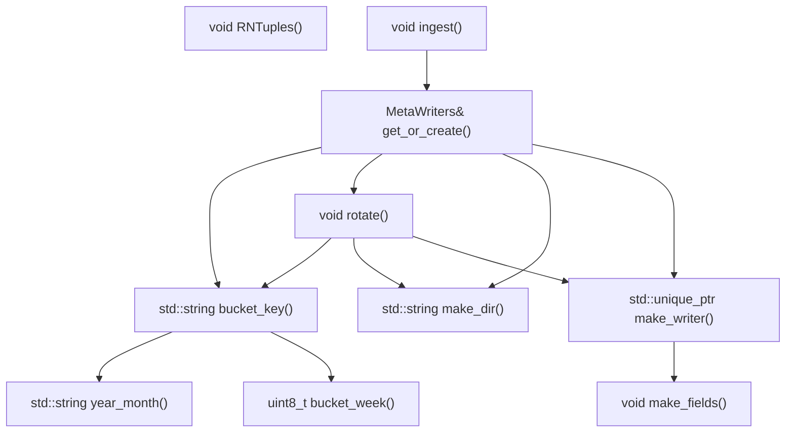
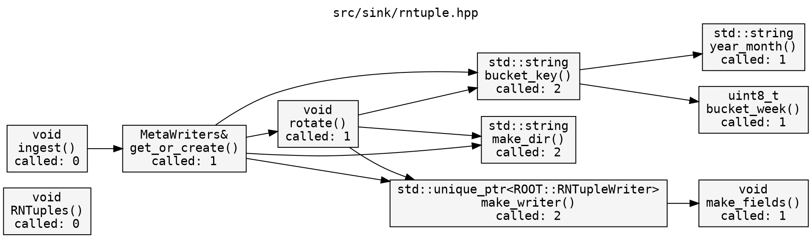

# calltree.sh

ASCII call tree generator for a single C++ file.  
Parses function definitions and call edges statically using Perl, then renders them as a tree in the terminal.  
Optionally exports to Mermaid (GitHub-renderable), Graphviz DOT, and plain text.

```
  src/sink/rntuple.hpp  (depth=4)

RNTuples()  -> void

ingest()  -> void
└── get_or_create()  -> MetaWriters&
    ├── bucket_key()  -> std::string
    │   ├── year_month()  -> std::string
    │   └── bucket_week()  -> uint8_t
    ├── rotate()  -> void
    │   ├── bucket_key()  -> std::string  [seen]
    │   ├── make_dir()  -> std::string
    │   └── make_writer()  -> std::unique_ptr<ROOT::RNTupleWriter>
    │       └── make_fields()  -> void
    ├── make_dir()  -> std::string
    └── make_writer()  -> std::unique_ptr<ROOT::RNTupleWriter>  [seen]
```

---

## Dependencies

| Dep | Notes |
|-----|-------|
| `bash` | >= 4.0 |
| `perl` | Standard on Linux and macOS, no extra modules needed |
| `graphviz` | Optional — only needed to render `.dot` output (`dot -Tsvg`) |

---

## Installation

```bash
git clone https://github.com/MoonFlowww/CallTree
cd CallTree
chmod +x calltree.sh
```

Or drop `calltree.sh` anywhere on your `$PATH`:

```bash
cp calltree.sh ~/.local/bin/calltree
```

---

## Usage

```
./calltree.sh <file.cpp> [OPTIONS]
```

### Options

| Flag | Argument | Default | Description |
|------|----------|---------|-------------|
| `--depth` | `N` | `4` | Recursion depth in the tree |
| `--root` | `FUNC` | auto | Start tree from a specific function instead of auto-detected roots |
| `--color` | — | off | Colorize function names in terminal using 256-color ANSI |
| `--see` | — | off | show redundant sub-tree (hidden by default with `[seen]`) |
| `--out-mermaid` | `[FILE]` | `<file>.mmd` | Write Mermaid graph to file (renders in GitHub/GitLab/Notion) |
| `--out-dot` | `[FILE]` | `<file>.dot` | Write Graphviz DOT to file |
| `--out-txt` | `[FILE]` | `<file>.txt` | Write plain-text tree to file (no ANSI codes) |


File arguments for `--out-*` flags are optional. When omitted, the output filename is derived from the input file:

```bash
./calltree.sh src/foo.cpp --out-mermaid           # writes src/foo.mmd
./calltree.sh src/foo.cpp --out-mermaid graph.mmd # writes graph.mmd
```

---

## Examples

### Basic tree

```bash
./calltree.sh src/sink/rntuple.hpp
```

### Limit depth

```bash
./calltree.sh src/sink/rntuple.hpp --depth 2
```

```
ingest()  -> void
└── get_or_create()  -> MetaWriters&
    ├── bucket_key()  -> std::string
    ├── rotate()  -> void
    ├── make_dir()  -> std::string
    └── make_writer()  -> std::unique_ptr<ROOT::RNTupleWriter>
```

### Start from a specific function
```bash
./calltree.sh src/sink/rntuple.hpp --root rotate
```
> **rotate** is the name of the function that you want to take as "root"
```
rotate()  -> void
├── bucket_key()  -> std::string
│   ├── year_month()  -> std::string
│   └── bucket_week()  -> uint8_t
├── make_dir()  -> std::string
└── make_writer()  -> std::unique_ptr<ROOT::RNTupleWriter>
    └── make_fields()  -> void
```

### Terminal colors

```bash
./calltree.sh src/sink/rntuple.hpp --color
```

Each function name is assigned a unique 256-color ANSI color.  
Colors are derived from the sorted function list so they stay stable across runs.  
The usable palette is clamped to indices `40–210` — near-black and near-white tones are excluded.

```
color index = 40 + round(170 * i / (N - 1))
```

Colors also apply in the summary table's `calls` column.

### Export to Mermaid

```bash
./calltree.sh src/sink/rntuple.hpp --out-mermaid
```

Writes `src/sink/rntuple.mmd`, fenced in ` ```mermaid ``` ` blocks so it renders directly when pasted into a GitHub README, GitLab wiki, or Notion page.

```Markdown
graph TD
    RNTuples["void RNTuples()"]
    ingest["void ingest()"]
    bucket_week["uint8_t bucket_week()"]
    year_month["std::string year_month()"]
    bucket_key["std::string bucket_key()"]
    make_dir["std::string make_dir()"]
    get_or_create["MetaWriters& get_or_create()"]
    rotate["void rotate()"]
    make_fields["void make_fields()"]
    make_writer["std::unique_ptr<ROOT::RNTupleWriter> make_writer()"]

    ingest --> get_or_create
    bucket_key --> year_month
    bucket_key --> bucket_week
    get_or_create --> bucket_key
    get_or_create --> rotate
    get_or_create --> make_dir
    get_or_create --> make_writer
    rotate --> bucket_key
    rotate --> make_dir
    rotate --> make_writer
    make_writer --> make_fields
```
Representation:


### Export to Graphviz DOT

```bash
./calltree.sh src/sink/rntuple.hpp --out-dot
```

Render the `.dot` file to SVG or PNG:

```bash
dot -Tsvg -o graph.svg src/sink/rntuple.dot
dot -Tpng -o graph.png src/sink/rntuple.dot
```

Node labels include the return type and call frequency:


Representation:


### Export to plain text

```bash
./calltree.sh src/sink/rntuple.hpp --out-txt
```

representation:
```txt
  src/sink/rntuple.hpp  (depth=4)

rotate()  -> void
├── bucket_key()  -> std::string
│   ├── year_month()  -> std::string
│   └── bucket_week()  -> uint8_t
├── make_dir()  -> std::string
└── make_writer()  -> std::unique_ptr<ROOT::RNTupleWriter>
    └── make_fields()  -> void


  function                      called  calls                                     return type
  ────────────────────────────  ──────  ────────────────────────────────────────  ──────────────────────
  bucket_week                        1  ----                                      uint8_t
  year_month                         1  ----                                      std::string
  bucket_key                         2  year_month bucket_week                    std::string
  make_dir                           2  ----                                      std::string
  rotate                             1  bucket_key make_dir make_writer           void
  make_fields                        1  ----                                      void
  make_writer                        2  make_fields                               std::unique_ptr<ROOT::RNTupleWriter>
```

Identical layout to the terminal output, with no ANSI codes — safe to `grep`, `diff`, or commit.

### All outputs at once

```bash
./calltree.sh src/sink/rntuple.hpp --color --out-mermaid --out-dot --out-txt
```

---

## Summary table

The table is always printed below the tree:

```
  function                      called  calls                                     return type
  ────────────────────────────  ──────  ────────────────────────────────────────  ──────────────────────
  bucket_week                        1  ----                                      uint8_t
  year_month                         1  ----                                      std::string
  bucket_key                         2  year_month bucket_week                    std::string
  make_dir                           2  ----                                      std::string
  rotate                             1  bucket_key make_dir make_writer           void
  make_fields                        1  ----                                      void
  make_writer                        2  make_fields                               std::unique_ptr<ROOT::RNTupleWriter>
```

| Column | Description |
|--------|-------------|
| `function` | Function name as defined in the file |
| `called` | Total number of times this function is invoked across all callers |
| `calls` | Space-separated list of functions this function calls |
| `return type` | Extracted from the line preceding the function definition |

---

## How it works

### What counts as a function

The Perl parser matches any identifier of the form:

```
name(...) [const|override|noexcept...] {
```

This captures free functions, class methods, and constructors. Control-flow keywords (`if`, `for`, `while`, `switch`, etc.) are explicitly excluded. Member calls (`obj.foo()`, `ptr->foo()`) are excluded by rejecting identifiers immediately preceded by `.` or `->`.

### Return type extraction

For each matched definition, the parser walks backward to the start of the line, strips scope prefixes (`Foo::`) and storage-class keywords (`static`, `inline`, `constexpr`, `consteval`, `constinit`, `noexcept`, `requires`, `co_await`, `co_return`, `co_yield`, `virtual`, `explicit`, `extern`, `friend`), and treats whatever remains as the return type. Falls back to `void` when the prefix is empty or syntactic noise only.

### Call edge detection

For every function `F`, `extract_body()` locates its braced body by counting brace depth from the opening `{`. The body text is then scanned for occurrences of every other known function name followed by `(`, not preceded by `.` or `->`. Each hit is counted; the total across all callers is the `called` frequency in the table.

### Cycle detection

The tree emitter threads a colon-delimited `VISITED` string down the call stack. If a node appears in its own ancestor path, it is printed with `[cycle]` and recursion stops. Nodes reached via different paths are drawn in full — both call sites are real and belong in the documentation.

---

## Limitations

- Single-file only: cross-file calls are not resolved.
- The parser is regex-based, not a full AST. Complex declarations (multi-line signatures, macro-wrapped definitions, trailing return types) may not be detected.
- Template specialisations (`process<T>` vs `process<U>`) map to the same base name.
- `#define`d pseudo-functions are not detected.
