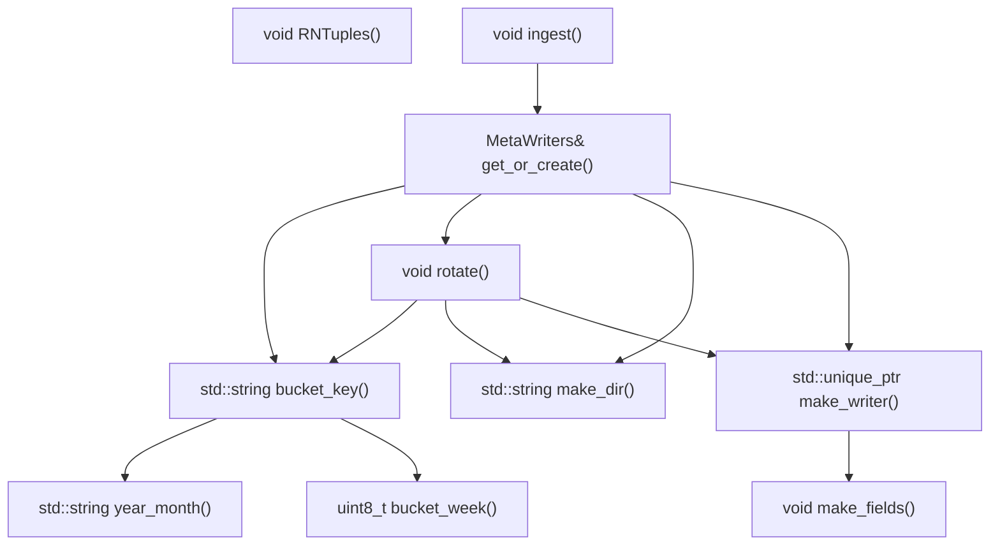
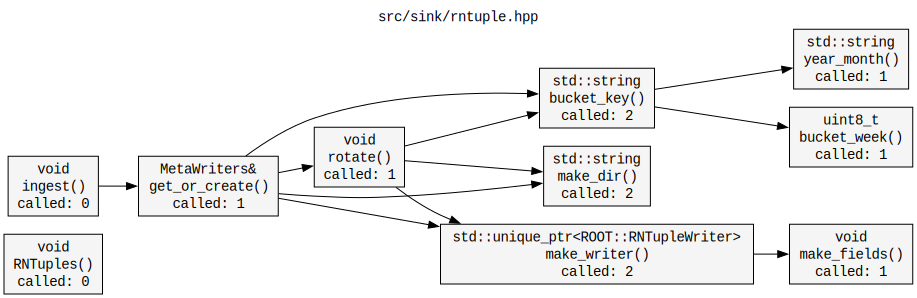

# calltree.sh

ASCII call tree generator for C++ files — single file or entire project.  
Parses function definitions and call edges statically using Perl, then renders them as a tree in the terminal.  
Supports cross-file call resolution, recursive directory scanning, whitelist/blacklist filtering, and exports to Mermaid, Graphviz DOT, and plain text.

```
  src/sink/rntuple.hpp  (depth=4)

RNTuples()  -> void

ingest()  -> void
└── get_or_create()  -> MetaWriters&
    ├── bucket_key()  -> std::string
    │   ├── year_month()  -> std::string
    │   └── bucket_week()  -> uint8_t
    ├── rotate()  -> void
    │   ├── bucket_key()  -> std::string  [seen]
    │   ├── make_dir()  -> std::string
    │   └── make_writer()  -> std::unique_ptr<ROOT::RNTupleWriter>
    │       └── make_fields()  -> void
    ├── make_dir()  -> std::string
    └── make_writer()  -> std::unique_ptr<ROOT::RNTupleWriter>  [seen]
```

---

## Dependencies

| Dep | Notes |
|-----|-------|
| `bash` | >= 4.0 |
| `perl` | Standard on Linux and macOS, no extra modules needed |
| `graphviz` | Optional — only needed to render `.dot` output (`dot -Tsvg`) |

---

## Installation

```bash
git clone https://github.com/MoonFlowww/CallTree
cd CallTree
chmod +x calltree.sh
```

Or drop `calltree.sh` anywhere on your `$PATH`:

```bash
cp calltree.sh ~/.local/bin/calltree
```

---

## Usage

```
# Single file (fully backward-compatible)
./calltree.sh <file.cpp> [OPTIONS]

# Multiple explicit files
./calltree.sh file1.cpp file2.cpp file3.hpp [OPTIONS]

# Recursive directory scan
./calltree.sh --dir <src/> [OPTIONS]

# Directory scan with filtering
./calltree.sh --dir <src/> --include "*.cpp" --exclude "test_*" [OPTIONS]
```

### Options

| Flag | Argument | Default | Description |
|------|----------|---------|-------------|
| `--depth` | `N` | `4` | Recursion depth in the tree |
| `--root` | `FUNC` | auto | Start tree from a specific function. In multi-file mode, accepts either a bare function name (auto-picks the first file that defines it) or a fully-qualified key `filepath::::funcname` to pin a specific file |
| `--dir` | `DIR` | — | Recursively scan `DIR` for C++ files (`.cpp .hpp .cc .cxx .h .hxx`). Repeatable — multiple `--dir` flags accumulate |
| `--include` | `PATTERN` | — | Keep only files whose **basename** matches this glob. Repeatable. Applied before `--exclude`. When absent, all files pass |
| `--exclude` | `PATTERN` | — | Drop files whose **basename** matches this glob. Repeatable. Takes precedence over `--include` matches |
| `--color` | — | off | Colorize function names in terminal using 256-color ANSI |
| `--see` | — | off | Always expand repeated subtrees (disable `[seen]` compression) |
| `--out-mermaid` | `[FILE]` | `<base>.mmd` | Write Mermaid graph. In multi-file mode, wraps each file's functions in a named subgraph |
| `--out-dot` | `[FILE]` | `<base>.dot` | Write Graphviz DOT. In multi-file mode, wraps each file's functions in a cluster |
| `--out-txt` | `[FILE]` | `<base>.txt` | Write plain-text tree (no ANSI codes) |

File arguments for `--out-*` flags are optional. When omitted, the output path is derived automatically:

```bash
# Single file
./calltree.sh src/foo.cpp --out-mermaid           # → src/foo.mmd
./calltree.sh src/foo.cpp --out-mermaid graph.mmd # → graph.mmd

# --dir
./calltree.sh --dir src/ --out-mermaid            # → src/calltree.mmd
./calltree.sh --dir src/ --out-dot                # → src/calltree.dot

# Multiple positional files (no --dir)
./calltree.sh a.cpp b.cpp --out-dot               # → ./calltree.dot
```

---

## Single-file examples

### Basic tree

```bash
./calltree.sh src/sink/rntuple.hpp
```

### Limit depth

```bash
./calltree.sh src/sink/rntuple.hpp --depth 2
```

```
ingest()  -> void
└── get_or_create()  -> MetaWriters&
    ├── bucket_key()  -> std::string
    ├── rotate()  -> void
    ├── make_dir()  -> std::string
    └── make_writer()  -> std::unique_ptr<ROOT::RNTupleWriter>
```

### Start from a specific function

```bash
./calltree.sh src/sink/rntuple.hpp --root rotate
```

```
rotate()  -> void
├── bucket_key()  -> std::string
│   ├── year_month()  -> std::string
│   └── bucket_week()  -> uint8_t
├── make_dir()  -> std::string
└── make_writer()  -> std::unique_ptr<ROOT::RNTupleWriter>
    └── make_fields()  -> void
```

### Terminal colors

```bash
./calltree.sh src/sink/rntuple.hpp --color
```

Each function name is assigned a unique 256-color ANSI color.  
Colors are derived from the sorted function list so they stay stable across runs.  
The usable palette is clamped to indices `40–210` — near-black and near-white tones are excluded.

```
color index = 40 + round(170 * i / (N - 1))
```

Colors also apply in the summary table's `calls` column.

### Export to Mermaid

```bash
./calltree.sh src/sink/rntuple.hpp --out-mermaid
```

Writes `src/sink/rntuple.mmd`, fenced in ` ```mermaid ``` ` blocks so it renders directly when pasted into a GitHub README, GitLab wiki, or Notion page.



### Export to Graphviz DOT

```bash
./calltree.sh src/sink/rntuple.hpp --out-dot
```

Render the `.dot` file to SVG or PNG:

```bash
dot -Tsvg -o graph.svg src/sink/rntuple.dot
dot -Tpng -o graph.png src/sink/rntuple.dot
```

Node labels include the return type and call frequency.



### Export to plain text

```bash
./calltree.sh src/sink/rntuple.hpp --out-txt
```

Identical layout to the terminal output, with no ANSI codes — safe to `grep`, `diff`, or commit.

```txt
  src/sink/rntuple.hpp  (depth=4)

rotate()  -> void
├── bucket_key()  -> std::string
│   ├── year_month()  -> std::string
│   └── bucket_week()  -> uint8_t
├── make_dir()  -> std::string
└── make_writer()  -> std::unique_ptr<ROOT::RNTupleWriter>
    └── make_fields()  -> void


  function                      called  calls                                     return type
  ────────────────────────────  ──────  ────────────────────────────────────────  ──────────────────────
  bucket_week                        1  ----                                      uint8_t
  year_month                         1  ----                                      std::string
  bucket_key                         2  year_month bucket_week                    std::string
  make_dir                           2  ----                                      std::string
  rotate                             1  bucket_key make_dir make_writer           void
  make_fields                        1  ----                                      void
  make_writer                        2  make_fields                               std::unique_ptr<ROOT::RNTupleWriter>
```

### All outputs at once

```bash
./calltree.sh src/sink/rntuple.hpp --color --out-mermaid --out-dot --out-txt
```

---

## Multi-file examples

Multi-file mode is activated whenever more than one file is provided, either via multiple positional arguments or via `--dir`. All original flags continue to work identically; the only visual changes are the `[basename]` annotations in the tree and an extra `file` column in the summary table.

### Two explicit files

```bash
./calltree.sh src/core.cpp src/net.cpp --depth 3
```

<!-- PLACEHOLDER: terminal output showing cross-file tree with [basename] annotations -->
```
  2 files  (depth=3)

dispatch()  [core.cpp]  -> void
├── make_key()  [core.cpp]  -> std::string
│   └── format()  [net.cpp]  -> int
└── send()  [net.cpp]  -> void
    ├── encode()  [net.cpp]  -> std::string
    │   └── compress()  [net.cpp]  -> std::string
    └── flush()  [net.cpp]  -> void
        └── write_buf()  [net.cpp]  -> void


  function                      file                    called  calls                                     return type
  ────────────────────────────  ──────────────────────  ──────  ────────────────────────────────────────  ──────────────────────
  make_key                      core.cpp                     1  format                                    std::string
  dispatch                      core.cpp                     0  make_key send                             void
  ...
```

Cross-file calls are shown inline in the tree. The `[basename]` tag after each function name shows which file it lives in — it only appears in multi-file mode.

### Recursive directory scan

```bash
./calltree.sh --dir src/ --depth 4
```

Scans `src/` recursively for all `.cpp .hpp .cc .cxx .h .hxx` files (sorted, deduplicated), analyzes them as a single unit, and prints the unified call tree.

<!-- PLACEHOLDER: real project tree showing cross-file resolution across multiple files -->

### Directory scan with filtering

```bash
# Only implementation files, not headers
./calltree.sh --dir src/ --include "*.cpp"

# Exclude generated and test files
./calltree.sh --dir src/ --exclude "*.pb.cc" --exclude "test_*" --exclude "*_mock.*"

# Combined — only implementation, no tests
./calltree.sh --dir src/ --include "*.cpp" --exclude "test_*"
```

`--include` and `--exclude` both match against the **basename** of each file using standard shell glob syntax. Processing order: `--include` is applied first (if any are specified); then `--exclude` is applied to the surviving set. Both flags are repeatable.

### Rooting across files

```bash
# Bare function name — auto-picks the first file that defines it
./calltree.sh --dir src/ --root dispatch

# Fully-qualified key — pin to a specific file when the name is ambiguous
./calltree.sh --dir src/ --root "src/core.cpp::::dispatch"
```

The `FILE::::FUNC` key syntax uses four colons as a separator (safe since `::::` cannot appear in C++ identifiers or typical paths).

### Multi-file Mermaid export

```bash
./calltree.sh --dir src/ --out-mermaid
# → src/calltree.mmd
```

Each file's functions are grouped in a named `subgraph`. Cross-file edges connect nodes across subgraphs automatically.

```markdown
```mermaid
graph TD
  subgraph core_cpp["core.cpp"]
    core_cpp_make_key["std::string make_key()"]
    core_cpp_dispatch["void dispatch()"]
  end
  subgraph net_cpp["net.cpp"]
    net_cpp_send["void send()"]
    net_cpp_flush["void flush()"]
    net_cpp_encode["std::string encode()"]
    ...
  end

  core_cpp_make_key --> net_cpp_format
  core_cpp_dispatch --> core_cpp_make_key
  core_cpp_dispatch --> net_cpp_send
  ...
```​
```

Node IDs use `SAFE_BASENAME_funcname` to stay unique even when two files define a function with the same name.

<!-- PLACEHOLDER: rendered Mermaid screenshot of a real multi-file project -->

### Multi-file DOT export

```bash
./calltree.sh --dir src/ --out-dot
dot -Tsvg -o graph.svg src/calltree.dot
```

Each file becomes a `subgraph cluster_N` with its own label and a light grey background. Cross-cluster edges are drawn between the full-path node IDs.

<!-- PLACEHOLDER: rendered DOT/SVG screenshot of a real multi-file project -->

---

## Summary table

The table is always printed below the tree. In multi-file mode it gains a `file` column.

**Single-file:**
```
  function                      called  calls                                     return type
  ────────────────────────────  ──────  ────────────────────────────────────────  ──────────────────────
  bucket_week                        1  ----                                      uint8_t
  year_month                         1  ----                                      std::string
  bucket_key                         2  year_month bucket_week                    std::string
  make_dir                           2  ----                                      std::string
  rotate                             1  bucket_key make_dir make_writer           void
  make_fields                        1  ----                                      void
  make_writer                        2  make_fields                               std::unique_ptr<ROOT::RNTupleWriter>
```

**Multi-file:**
```
  function                      file                    called  calls                                     return type
  ────────────────────────────  ──────────────────────  ──────  ────────────────────────────────────────  ──────────────────────
  make_key                      core.cpp                     1  format                                    std::string
  dispatch                      core.cpp                     0  make_key send                             void
  send                          net.cpp                      1  encode flush                              void
  ...
```

| Column | Description |
|--------|-------------|
| `function` | Function name as defined in the file |
| `file` | Basename of the file where the function is defined *(multi-file mode only)* |
| `called` | Total number of times this function is invoked across all callers in the analyzed set |
| `calls` | Space-separated list of functions this function calls (display names only, stripped of file path) |
| `return type` | Extracted from the line preceding the function definition |

---

## How it works

### Single-file vs multi-file

In single-file mode, function keys are bare names. In multi-file mode, the internal key is `filepath::::funcname` throughout — in the tree, the table, and the export files. The four-colon separator is chosen because it cannot appear in a C++ identifier. Display always strips the path back to a bare function name; the file is shown separately as an annotation or table column.

### What counts as a function

The Perl parser matches any identifier of the form:

```
name(...) [const|override|noexcept...] {
```

This captures free functions, class methods, and constructors. Control-flow keywords (`if`, `for`, `while`, `switch`, etc.) are explicitly excluded. Member calls (`obj.foo()`, `ptr->foo()`) are excluded by rejecting identifiers immediately preceded by `.` or `->`.

### Return type extraction

For each matched definition, the parser walks backward to the start of the line, strips scope prefixes (`Foo::`) and storage-class keywords (`static`, `inline`, `constexpr`, `consteval`, `constinit`, `noexcept`, `requires`, `co_await`, `co_return`, `co_yield`, `virtual`, `explicit`, `extern`, `friend`), and treats whatever remains as the return type. Falls back to `void` when the prefix is empty or syntactic noise only.

### Call edge detection

For every function `F`, `extract_body()` locates its braced body by counting brace depth from the opening `{`. The body text is then scanned for occurrences of every other known function name followed by `(`, not preceded by `.` or `->`. Each hit is counted; the total across all callers is the `called` frequency in the table.

### Cross-file call resolution

When multiple files are analyzed, the Perl pass reads all sources in a single invocation. Pass 1 builds a global `funcname → [files that define it]` registry. Pass 2 scans each function body and, for every callee found in the global registry, applies this resolution rule:

1. If the callee is defined in the **same file** as the caller, use that definition.
2. Otherwise, use the **first file** in definition-order that defines the callee.

This matches compiler lookup semantics for non-overloaded free functions and ensures that same-file helper calls are never misattributed to a homonymous function in another file.

### File collection (`--dir`)

`find` is invoked with `-print0` and the result piped through `sort -z`, so filenames with spaces and special characters are handled correctly. The standard C++ extensions searched are `.cpp .hpp .cc .cxx .h .hxx`. `--include` and `--exclude` patterns are applied in bash using `case`/glob matching against basenames only.

### Cycle detection

The tree emitter threads a colon-delimited `VISITED` string down the call stack. If a node appears in its own ancestor path, it is printed with `[cycle]` and recursion stops. Nodes reached via different paths are drawn in full — both call sites are real and belong in the documentation.

---

## Limitations

- The parser is regex-based, not a full AST. Complex declarations (multi-line signatures, macro-wrapped definitions, trailing return types) may not be detected.
- Template specialisations (`process<T>` vs `process<U>`) map to the same base name.
- `#define`d pseudo-functions are not detected.
- Cross-file resolution picks the **first** matching definition when a name is defined in multiple files. There is no overload resolution or namespace awareness.
- File paths containing spaces are supported by the `--dir` scanner but must be quoted carefully when passed as positional arguments.
- File paths containing the literal string `::::` are not supported (this sequence is reserved as the internal separator).
